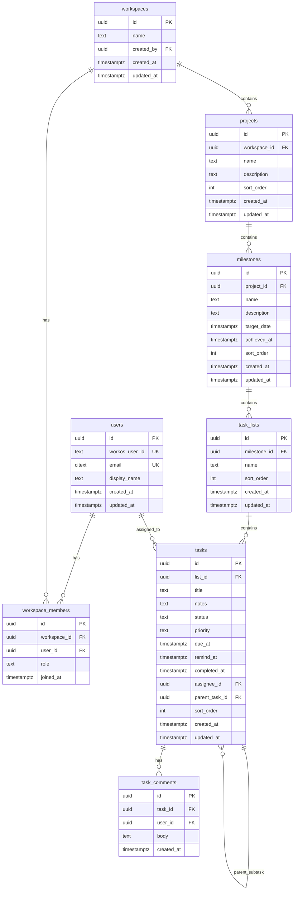

# Plan Constitutivo — DoTask

> Documento constitutivo del proyecto DoTask: aplicación de gestión de tareas tipo Microsoft To Do, multiplataforma, con soporte para equipos de trabajo.

---

## 1. Visión del producto

DoTask ofrece una experiencia de gestión de tareas personales y colaborativas inspirada en Microsoft To Do, con estas características diferenciadoras:

- **Organización jerárquica**: las tareas se estructuran bajo proyectos e hitos dentro de cada espacio de trabajo (Workspace → Proyecto → Hito → Lista → Tarea).
- **Trabajo en equipo**: espacios de trabajo compartidos con roles (owner, member, guest), asignación de tareas y comentarios.
- **Multiplataforma**: una sola base de código React sirve como PWA en la web y como app nativa en Android/iOS vía Capacitor.

---

## 2. Stack tecnológico

| Capa | Tecnología | Notas |
|------|------------|-------|
| Frontend | React 18+, Vite, TypeScript | SPA con React Router |
| UI | shadcn/ui | Componentes accesibles y consistentes |
| PWA | Manifest + Workbox (plugin Vite) | Shell offline limitado; datos desde API |
| Móvil | Capacitor (Android / iOS) | Empaqueta el build Vite |
| Backend | NestJS (TypeScript) | Módulos, DI, guards, pipes |
| ORM / Migraciones | Prisma | Migraciones versionadas, tipos generados |
| Base de datos | PostgreSQL | Fuente de verdad |
| Cache / Colas | Redis (BullMQ) | Rate limiting, notificaciones, recordatorios |
| Autenticación | WorkOS (AuthKit) | Sin contraseñas locales; SSO, Magic Auth, OAuth |
| Despliegue | Dokploy | Frontend estático, backend Node, Postgres, Redis |

**Idioma de la interfaz**: español.  
**Idioma del código** (variables, métodos, componentes): inglés.  
**Metodología de desarrollo**: TDD — siempre ejecutar pruebas y autocorregir errores.

---

## 3. Autenticación con WorkOS

### Proveedor

WorkOS AuthKit concentra todo el login: email mágico, contraseña (si se habilita en WorkOS), Google, Microsoft y cualquier conexión SSO empresarial configurada en el dashboard.

### Flujo web / PWA

1. El frontend redirige al **hosted sign-in** de WorkOS.
2. Tras autenticarse, WorkOS devuelve al usuario a la **redirect URI** (callback en el backend).
3. El servidor intercambia el código con el SDK `@workos-inc/node`, obtiene el perfil del usuario y establece la sesión (cookie sellada o JWT propio validado contra JWKS).
4. En cada petición posterior, un guard de NestJS valida la sesión, ejecuta un **upsert** de `users` por `workos_user_id` y adjunta el `userId` interno al contexto.

### Capacitor (iOS / Android)

Registrar en el dashboard de WorkOS los redirect URI adecuados:

- Producción: HTTPS del dominio real.
- Desarrollo: esquema custom `capacitor://` o `https://localhost` según la guía de Capacitor.

### Variables de entorno (backend)

| Variable | Descripción |
|----------|-------------|
| `WORKOS_API_KEY` | Clave secreta de API — **nunca** exponer en el cliente |
| `WORKOS_CLIENT_ID` | ID de cliente de WorkOS |
| `WORKOS_COOKIE_PASSWORD` | Secreto para cookie sellada (si aplica al modo AuthKit elegido) |
| `WORKOS_REDIRECT_URI` | URI de callback alineada con Dokploy |

En Vite solo se exponen variables con prefijo `VITE_` si el flujo lo requiere (p. ej. `VITE_WORKOS_CLIENT_ID`).

### WorkOS y equipos

Los workspaces de DoTask son entidad propia en Postgres. Opcionalmente, en fases posteriores se puede alinear las invitaciones con WorkOS Organizations.

---

## 4. Estructura de la base de datos

### 4.1 Convenciones

- Claves primarias: `uuid` con `gen_random_uuid()`.
- Timestamps: `timestamptz`.
- Nombres de tablas y columnas: `snake_case`.
- Extensión `citext` para emails case-insensitive.

### 4.2 Jerarquía de contenido

```
Workspace → Project → Milestone (hito) → TaskList → Task
```

- Cada workspace contiene uno o más proyectos.
- Cada proyecto contiene hitos que segmentan el trabajo en fases o entregas.
- Cada hito contiene listas de tareas.
- Las tareas pertenecen a una lista concreta.

### 4.3 Diagrama entidad-relación



### 4.4 Tablas y columnas (detalle)

#### `users`

| Columna | Tipo | Notas |
|---------|------|-------|
| `id` | `uuid` | PK interna |
| `workos_user_id` | `text` | Único; ID de usuario en WorkOS (`user_...`) |
| `email` | `citext` | Único; sincronizado desde WorkOS |
| `display_name` | `text` | Nombre visible; desde WorkOS |
| `created_at`, `updated_at` | `timestamptz` | |

Índices únicos en `workos_user_id` y `email`. Sin `password_hash`: las credenciales viven en WorkOS.

**Sesión y tokens**: en MVP la sesión se gestiona con el flujo recomendado por WorkOS (cookie sellada o JWT contra JWKS). La tabla `refresh_tokens` no forma parte del núcleo; se añade como opcional si se emiten tokens propios de larga duración.

#### `workspaces`

| Columna | Tipo | Notas |
|---------|------|-------|
| `id` | `uuid` | PK |
| `name` | `text` | |
| `created_by` | `uuid` | FK → `users(id)` |
| `created_at`, `updated_at` | `timestamptz` | |

**Regla de producto**: en el primer login exitoso vía WorkOS (upsert de `users`), crear un workspace "Personal", fila `workspace_members` con rol `owner`, un proyecto por defecto, un hito inicial ("Backlog") y opcionalmente una lista vacía.

#### `workspace_members`

| Columna | Tipo | Notas |
|---------|------|-------|
| `id` | `uuid` | PK |
| `workspace_id` | `uuid` | FK → `workspaces(id)` ON DELETE CASCADE |
| `user_id` | `uuid` | FK → `users(id)` ON DELETE CASCADE |
| `role` | `text` | `owner` / `member` / `guest` |
| `joined_at` | `timestamptz` | |

Restricción única: `(workspace_id, user_id)`. Índice en `(user_id)`.

#### `projects`

| Columna | Tipo | Notas |
|---------|------|-------|
| `id` | `uuid` | PK |
| `workspace_id` | `uuid` | FK → `workspaces(id)` ON DELETE CASCADE |
| `name` | `text` | |
| `description` | `text` | Nullable |
| `sort_order` | `int` | Orden dentro del workspace |
| `created_at`, `updated_at` | `timestamptz` | |

Índice: `(workspace_id, sort_order)`.

#### `milestones`

| Columna | Tipo | Notas |
|---------|------|-------|
| `id` | `uuid` | PK |
| `project_id` | `uuid` | FK → `projects(id)` ON DELETE CASCADE |
| `name` | `text` | |
| `description` | `text` | Nullable |
| `target_date` | `timestamptz` | Nullable; fecha objetivo |
| `achieved_at` | `timestamptz` | Nullable; si no null, hito cerrado |
| `sort_order` | `int` | Orden dentro del proyecto |
| `created_at`, `updated_at` | `timestamptz` | |

Índice: `(project_id, sort_order)`.

#### `task_lists`

| Columna | Tipo | Notas |
|---------|------|-------|
| `id` | `uuid` | PK |
| `milestone_id` | `uuid` | FK → `milestones(id)` ON DELETE CASCADE |
| `name` | `text` | |
| `sort_order` | `int` | Orden dentro del hito |
| `created_at`, `updated_at` | `timestamptz` | |

Índice: `(milestone_id, sort_order)`.

#### `tasks`

| Columna | Tipo | Notas |
|---------|------|-------|
| `id` | `uuid` | PK |
| `list_id` | `uuid` | FK → `task_lists(id)` ON DELETE CASCADE |
| `title` | `text` | |
| `notes` | `text` | Nullable |
| `status` | `text` | `pending`, `completed` (extensible) |
| `priority` | `text` | `none`, `low`, `medium`, `high` |
| `due_at` | `timestamptz` | Nullable |
| `remind_at` | `timestamptz` | Nullable |
| `completed_at` | `timestamptz` | Nullable |
| `assignee_id` | `uuid` | Nullable; FK → `users(id)` ON DELETE SET NULL |
| `parent_task_id` | `uuid` | Nullable; FK → `tasks(id)` ON DELETE CASCADE |
| `sort_order` | `int` | Orden dentro de la lista |
| `created_at`, `updated_at` | `timestamptz` | |

Índices: `(list_id, sort_order)`, `(assignee_id)` parcial, `(parent_task_id)`.

#### `task_comments`

| Columna | Tipo | Notas |
|---------|------|-------|
| `id` | `uuid` | PK |
| `task_id` | `uuid` | FK → `tasks(id)` ON DELETE CASCADE |
| `user_id` | `uuid` | FK → `users(id)` ON DELETE SET NULL |
| `body` | `text` | |
| `created_at` | `timestamptz` | |

Índice: `(task_id, created_at)`.

### 4.5 Enumeraciones

- `workspace_members.role`: `owner`, `member`, `guest`.
- `tasks.status`: `pending`, `completed` (extensible a `in_progress`, `cancelled`).
- `tasks.priority`: `none`, `low`, `medium`, `high`.

### 4.6 Extensiones Postgres

- `citext` para `users.email`.
- `pg_trgm` (roadmap) para búsqueda full-text en títulos y notas.

### 4.7 Roadmap de esquema

- `task_attachments`: adjuntos con storage S3/compatible.
- SSO empresarial adicional: configuración en dashboard WorkOS.
- Notificaciones: colas en Redis con BullMQ usando `tasks.remind_at`.

---

## 5. API y seguridad

- REST versionada: `/v1/...`, JSON, errores normalizados.
- **Multi-tenant** por `workspaceId`; recursos anidados siguiendo la jerarquía:

```
/v1/workspaces/:wid/projects
/v1/workspaces/:wid/projects/:pid/milestones
/v1/workspaces/:wid/projects/:pid/milestones/:mid/lists
/v1/workspaces/:wid/projects/:pid/milestones/:mid/lists/:lid/tasks
```

- Siempre validar que cada entidad hija pertenece a la cadena del workspace indicado.
- Rutas protegidas: solo accesibles con identidad WorkOS válida mapeada a `users`.
- CORS configurado para dominio PWA y orígenes de Capacitor.
- Variables de entorno por servicio en Dokploy; sin secretos en el bundle del frontend.

---

## 6. Despliegue en Dokploy

| Servicio | Rol |
|----------|-----|
| Frontend | Artefacto estático de `vite build` servido por nginx |
| Backend | Contenedor Node (Nest) con healthcheck HTTP |
| Postgres | Volumen persistente; backups según política Dokploy |
| Redis | Persistencia opcional (AOF si aplica) |

- Red interna entre API, Postgres y Redis.
- SSL en el proxy de Dokploy hacia frontend y API.
- En el dashboard WorkOS, configurar la URL de producción y la redirect URI alineada con Dokploy.

### Variables de entorno requeridas

**Backend**:

| Variable | Descripción |
|----------|-------------|
| `DATABASE_URL` | Cadena de conexión PostgreSQL |
| `REDIS_URL` | Cadena de conexión Redis |
| `WORKOS_API_KEY` | Clave secreta WorkOS |
| `WORKOS_CLIENT_ID` | ID de cliente WorkOS |
| `WORKOS_COOKIE_PASSWORD` | Secreto para cookie de sesión |
| `WORKOS_REDIRECT_URI` | URI de callback |
| `FRONTEND_URL` | URL pública del frontend (CORS, redirects) |
| `PORT` | Puerto del servidor (default 3000) |

**Frontend** (prefijo `VITE_`):

| Variable | Descripción |
|----------|-------------|
| `VITE_API_URL` | URL pública del backend |
| `VITE_WORKOS_CLIENT_ID` | ID de cliente WorkOS (si el flujo lo requiere) |

---

## 7. Estructura del repositorio

```
DoTask/
├── apps/
│   ├── web/          # React + Vite + PWA + Capacitor
│   └── api/          # NestJS + Prisma
├── packages/
│   └── shared/       # Tipos, DTOs, validaciones Zod compartidas
├── docs/             # Este documento y arquitectura
├── docker-compose.yml
└── README.md
```

---

## 8. Fases de entrega

1. **Fundaciones**: login WorkOS (AuthKit), upsert usuario, workspace semilla, proyectos, hitos, listas y tareas CRUD (jerarquía completa), despliegue Dokploy mínimo (API + Postgres + secretos WorkOS).
2. **Colaboración**: miembros, roles, asignaciones, listas compartidas en el marco del mismo workspace/proyecto/hito.
3. **PWA + Capacitor**: manifest, service worker, builds iOS/Android, deep links.
4. **Redis**: colas/notificaciones, cache de lectura.

---

## 9. Criterios de calidad

- **TDD**: toda funcionalidad se desarrolla con tests primero; las pruebas se ejecutan y los errores se autocorrigen antes de dar por completada la tarea.
- **DRY**: métodos y componentes recursivos y reutilizables.
- **Componentes**: el frontend se estructura en componentes pequeños y enfocados, no en páginas monolíticas.
- **Idioma**: interfaz de usuario en español; código (variables, métodos, componentes) en inglés.
- **UI**: componentes shadcn/ui como base; construir componentes custom a partir de ellos cuando sea necesario.

---

## 10. Decisiones formalizadas

- **React + Vite + Capacitor + PWA** como frontend único.
- **PostgreSQL** como fuente de verdad.
- **Modelo de dominio**: Workspace → Proyecto → Hito → Lista → Tarea.
- **Redis** previsto para cache y colas cuando el producto lo requiera.
- **NestJS** como framework de backend.
- **Login**: WorkOS (AuthKit); usuarios identificados por `workos_user_id`, sin contraseñas locales.
- **Prisma** como ORM con migraciones versionadas.
